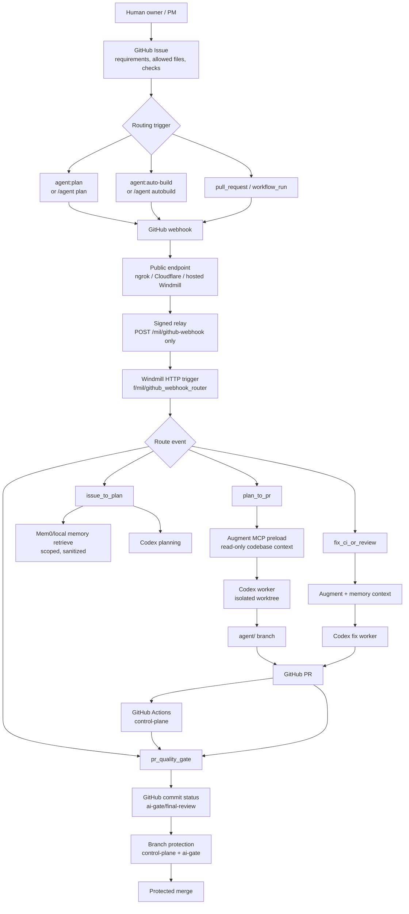
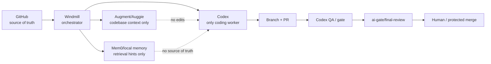

# MIL Agent Factory Workflow And Starter Kit

Status date: 2026-06-01.

This is the portable operating guide for using MIL as an agent-first software
delivery framework in a new project.

## 1. Workflow

### Full Delivery Flow



### Agent Responsibility Boundaries



Non-negotiable rule: Augment, Auggie, and Mem0 do not write code, open PRs, or
approve merges. Codex is the implementation worker. GitHub branch protection is
the merge authority.

## 2. Ways To Start A New Project

### Option A: Clone/Fork MIL As The Control Plane

Use this when the new project can start from the MIL repository layout.

1. Clone or fork the MIL repository.
2. Rename project identifiers:
   - `MIL`
   - `namlogan/MIL`
   - Windmill path prefix `f/mil`
   - MCP server name `mil-auggie-local`
   - webhook route `/mil/github-webhook`
3. Keep the existing test suite and run it after every rename.
4. Create new Windmill secrets and GitHub webhook secret. Do not reuse MIL
   secrets.

This is the fastest path.

### Option B: Copy The Framework Into An Existing Product Repo

Use this when the product repo already exists.

Copy these portable paths:

```text
.ai-factory/**
.github/**
.windmill/**
f/mil/**
scripts/agent-flow/**
scripts/agent-gate/**
scripts/agent-memory/**
scripts/ai-factory/**
scripts/windmill/**
tests/**
docs/**
AGENTS.md
README.md
wmill.yaml
wmill-lock.yaml
```

Then rename `f/mil` to the project namespace, for example `f/payments`, and
update:

```text
wmill.yaml
.windmill/env.example
.ai-factory/config.yaml
.ai-factory/runtime/*.json
docs/*.md
tests/*.py
scripts/windmill/run_github_webhook_relay_from_windmill_secret.sh
```

This path is safer for mature product repos because app code and agent control
plane stay in the same repository.

### Option C: Keep MIL As A Separate Control-Plane Repo

Use this when one MIL instance should supervise multiple product repos.

Required changes:

- Add `target_repo` and `repo_id` to issues/tasks.
- Make `allowed_files` and worktree roots point to the target repo.
- Create one Augment MCP wrapper per product repo.
- Keep memory retrieval scoped by `repo_id`.
- Publish statuses to the target product repo, not to MIL.

This is more powerful, but it needs stronger tenant/repo isolation before broad
use.

## 3. Required Setup For A New Project

### GitHub

Required:

```text
GitHub Issues
GitHub Pull Requests
GitHub Actions
Branch protection on main
Required checks:
- control-plane
- ai-gate/final-review
Webhook events:
- issues
- issue_comment
- pull_request
- workflow_run
```

Recommended labels:

```text
agent:plan
agent:build
agent:auto-build
agent:fix
blocked
ready-for-human-review
approved
```

### Windmill

Required scripts:

```text
f/mil/github_webhook_router
f/mil/github_commit_status
f/mil/issue_to_plan
f/mil/plan_to_pr
f/mil/pr_quality_gate
f/mil/fix_ci_or_review
f/mil/codex_worker
f/mil/memory_contract
```

Required secrets:

```text
f/mil/github_webhook_secret
f/mil/github_status_token
```

Deploy:

```bash
wmill sync push --dry-run --includes "f/mil/**"
wmill sync push --yes --includes "f/mil/**"
```

### Public Webhook Endpoint

Supported choices:

```text
ngrok static/dev domain       fastest, good for pilot
Cloudflare named tunnel       better for long-running local control station
hosted Windmill HTTP trigger  simplest if Windmill is already hosted
reverse proxy/domain          best when you own infra
```

Local relay mode:

```bash
tmux new-session -d -s mil-webhook-relay \
  'cd /path/to/project && MIL_AUTO_DISPATCH_ENABLED=1 MIL_AUTO_DISPATCH_PRELOAD_AUGMENT_CONTEXT=1 scripts/windmill/run_github_webhook_relay_from_windmill_secret.sh'
```

For complex code tasks, require Augment context:

```bash
MIL_AUTO_DISPATCH_REQUIRE_AUGMENT_CONTEXT=1
```

### Codex Worker

Required:

```bash
codex --version
gh auth status
python3 scripts/agent-flow/check_agent_tools.py
```

Worker behavior:

- Creates an isolated git worktree.
- Runs `codex exec`.
- Validates changed files against `allowed_files`.
- Runs task-required checks.
- Commits, pushes, and opens a PR only if scope/checks pass.

### Augment Context

Required per project:

```bash
codex mcp add <project>-auggie-local -- /path/to/project/scripts/agent-flow/auggie_mcp_server.sh
python3 scripts/agent-flow/check_mil_mcp_runtime.py --mcp-smoke
python3 scripts/agent-flow/augment_context_provider.py --query "Summarize this project" --timeout 45
```

Augment is read-only context. Nested Codex MCP calls may still be cancelled by
the Codex MCP approval layer, so the control plane preloads Augment context
before dispatch.

### Memory

Memory is optional at first.

Start modes:

```text
local JSONL adapter  simplest pilot mode
Mem0 OSS            self-hosted team mode
Mem0 Platform       hosted memory layer
```

Memory must store distilled operational facts only, never secrets, raw source,
raw transcripts, or generated patches before review.

## 4. How To Track Progress

### GitHub

```bash
gh issue list --label agent:auto-build --state open
gh pr list --state open
gh pr checks <PR_NUMBER> --watch --interval 10
gh pr view <PR_NUMBER> --json mergeStateStatus,statusCheckRollup,comments
gh run list --limit 10
```

Signals:

```text
Issue label agent:plan        planning requested
Issue label agent:auto-build  implementation dispatch requested
PR opened                     Codex worker reached PR readiness
control-plane success         GitHub CI passed
ai-gate/final-review success  Windmill PR gate approved
mergeStateStatus CLEAN        protected merge can proceed
```

### Windmill

```bash
wmill --workspace mil-local job list --script-path f/mil/github_webhook_router --limit 10 --json
wmill --workspace mil-local job result <JOB_ID>
wmill --workspace mil-local job logs <JOB_ID>
wmill --workspace mil-local job list --failed --limit 20
```

Important fields:

```text
route.flow
route.github.event
route.github.pr_number
result.decision
status_publish.ok
status_publish.context
status_publish.state
```

### Local Worker Runtime

```bash
tmux list-sessions | rg 'mil-webhook'
ps aux | rg 'github_webhook_public_relay|ngrok http|auto_dispatcher.py|codex exec'
find .ai-factory/queue/webhooks -name '*.result.json' -maxdepth 1 | sort | tail
jq '{decision, worker_status: .worker_result.status, pr_url: .worker_result.git.pr_url}' .ai-factory/queue/webhooks/<delivery>.result.json
```

### Evidence Locations

```text
GitHub Issue                requirements and acceptance criteria
GitHub PR                   diff, CI, gate comments, merge decision
GitHub checks/statuses      control-plane and ai-gate/final-review
Windmill jobs               webhook routing and status publish evidence
.ai-factory/qa/**           local QA evidence and smoke files
.ai-factory/queue/**        ignored local runtime queue/debug evidence
```

## 5. Backup And Restore

Create a portable backup:

```bash
python3 scripts/portable/create_agent_factory_backup.py \
  --project-id MIL \
  --output-dir "$HOME/Backups/MIL"
```

The backup produces:

```text
<prefix>.tar.gz       source snapshot of tracked framework files
<prefix>.bundle       git bundle with repository history
<prefix>.manifest.json  non-secret manifest and restore notes
```

The backup intentionally excludes:

```text
.git/**
.env
.env.*
.windmill/runtime/**
.ai-factory/queue/**
.ai-factory/tmp/**
.ai-factory/memory/*.jsonl
__pycache__/**
*.pyc
node_modules/**
```

Restore:

```bash
mkdir NEW_PROJECT
tar -xzf MIL-agent-factory-YYYYMMDD-HHMMSS.tar.gz -C NEW_PROJECT --strip-components 1
cd NEW_PROJECT
python3 -m unittest discover -s tests -v
python3 scripts/ai-factory/bootstrap_runtime.py --check
```

Then configure project-specific values:

```text
Project ID
GitHub owner/repo
Windmill namespace path
Webhook route
Webhook secret
GitHub status token
Augment MCP server name and repo path
Mem0 tenant/repo scope
Branch protection required contexts
```

## 6. First Smoke For A New Project

1. Create an issue with the Agent Task template.
2. Keep `allowed_files` to one harmless documentation file.
3. Add label `agent:auto-build`.
4. Watch:

```bash
wmill --workspace mil-local job list --script-path f/mil/github_webhook_router --limit 5 --json
gh pr list --state open
gh pr checks <PR_NUMBER> --watch
```

Expected:

```text
AUTO_DISPATCH_COMPLETED
CODEX_WORKER_COMPLETED
PR opened by worker
control-plane pass
ai-gate/final-review pass without manual publish
mergeStateStatus CLEAN
```

Only after this smoke passes should the project allow code tasks.
