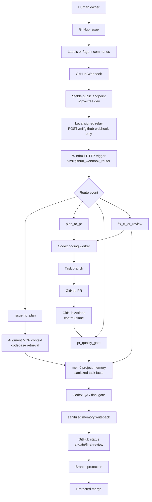

# Portable Agent Factory Runbook

Status date: 2026-06-01.

This document describes the current MIL automation frame and how to back it up
or move it into another repository.

For the current workflow diagram, new-project setup paths, and progress
tracking commands, start with
[MIL Agent Factory Workflow And Starter Kit](agent-factory-workflow-and-starter.md).

## Current Model



## Live Components

- GitHub repository: `namlogan/MIL`
- Protected branch: `main`
- Required checks: `control-plane`, `ai-gate/final-review`
- Webhook URL: `https://sublease-malformed-tribune.ngrok-free.dev/mil/github-webhook`
- Webhook events: `issues`, `issue_comment`, `pull_request`, `workflow_run`
- Local runtime sessions: `tmux` sessions `mil-webhook-relay` and `mil-webhook-ngrok`
- Windmill workspace profile: `mil-local`
- Windmill route: `f/mil/github_webhook_router`
- Windmill secret variables:
  - `f/mil/github_status_token`
  - `f/mil/github_webhook_secret`
- Codex MCP server: `mil-auggie-local`
- Augment role: codebase context provider, not a coding worker
- Mem0 role: optional long-term project/task memory through `mem0_memory`
- Coding/QA worker: Codex

## What To Back Up

### Commit To Git

These paths are the portable source of the framework:

```text
.ai-factory/**
.github/**
.windmill/**
f/mil/**
scripts/agent-flow/**
scripts/agent-gate/**
scripts/agent-memory/**
scripts/ai-factory/**
scripts/windmill/**
tests/**
docs/**
AGENTS.md
README.md
wmill.yaml
wmill-lock.yaml
.ai-factory/product-ci.json
```

Do not commit runtime folders, local env files, tunnel credentials, tokens, or
logs. Runtime memory files such as `.ai-factory/memory/*.jsonl` are ignored by
git and must not be used as source-controlled evidence.

Runtime memory backup is separate from the starter backup. For the same ongoing
project, copy `.ai-factory/memory/*.jsonl` to a private backup location before
cleanup, machine handoff, or migration. Do not include runtime memory in a
public starter bundle and do not restore it into another tenant/repo/project
scope.

### Non-Secret Snapshot

Use the backup packager for a clean source archive, git bundle, and non-secret
manifest:

```bash
python3 scripts/portable/create_agent_factory_backup.py \
  --project-id MIL \
  --output-dir "$HOME/Backups/MIL"
```

The script uses tracked files, excludes runtime/secret paths, and writes:

```text
MIL-agent-factory-<timestamp>.tar.gz
MIL-agent-factory-<timestamp>.bundle
MIL-agent-factory-<timestamp>.manifest.json
```

Manual equivalent:

```bash
mkdir -p "$HOME/Backups/MIL"
git bundle create "$HOME/Backups/MIL/MIL-$(date +%Y%m%d-%H%M).bundle" --all
git archive --format=tar.gz \
  -o "$HOME/Backups/MIL/MIL-source-$(date +%Y%m%d-%H%M).tar.gz" \
  HEAD
```

### External Config Snapshot

Back up platform configuration without secret values:

```bash
mkdir -p "$HOME/Backups/MIL/platform-$(date +%Y%m%d-%H%M)"
OUT="$HOME/Backups/MIL/platform-$(date +%Y%m%d-%H%M)"

gh api repos/namlogan/MIL/branches/main/protection \
  > "$OUT/github-branch-protection.json"
gh api repos/namlogan/MIL/hooks \
  > "$OUT/github-hooks.json"
gh api repos/namlogan/MIL/actions/secrets \
  > "$OUT/github-actions-secret-names.json"

wmill --workspace mil-local variable list --json \
  > "$OUT/windmill-variable-names.json"
wmill --workspace mil-local sync pull --dry-run --includes "f/mil/**" \
  > "$OUT/windmill-sync-dry-run.txt"

codex mcp list > "$OUT/codex-mcp-list.txt"
ngrok config check > "$OUT/ngrok-config-check.txt" 2>&1
tmux ls > "$OUT/tmux-sessions.txt"
```

Store actual secret values in a password manager or an encrypted vault, not in
the repo and not in the plain backup folder.

Required secret values to be able to restore:

```text
Windmill f/mil/github_webhook_secret
Windmill f/mil/github_status_token
ngrok authtoken
Augment / Auggie local credentials
No OpenAI/Ollama credential is required for MIL internal memory
Mem0 API key or REST endpoint, if an external provider is enabled later
OpenAI / Codex credentials, if not handled by the local app
GitHub token or GitHub App credentials for status publishing
```

The ngrok token used during setup was pasted into chat. Rotate it after the
pipeline is stable.

## Restore MIL On Another Machine

1. Restore source:

```bash
git clone <repo-url> MIL
cd MIL
# or:
git clone "$HOME/Backups/MIL/MIL-YYYYMMDD-HHMM.bundle" MIL
```

2. Install CLIs:

```bash
brew install ngrok/ngrok/ngrok
brew install cloudflared
# Install/restore wmill, gh, codex, auggie, tmux according to the workstation.
```

3. Validate repo contracts:

```bash
python3 -m unittest discover -s tests -v
python3 scripts/ai-factory/bootstrap_runtime.py --check --check-tools
python3 scripts/agent-memory/memory_contract.py --self-test
python3 scripts/agent-memory/check_mem0_provider.py
python3 scripts/project-intake/validate_project_intake.py
python3 scripts/operator/daily_status.py
python3 scripts/product-ci/run_product_checks.py
python3 scripts/agent-gate/validate_ai_factory.py --self-test
python3 scripts/windmill/validate_windmill_project.py --self-test
python3 scripts/agent-flow/check_mil_mcp_runtime.py --mcp-smoke
python3 -m compileall -q scripts tests f
git diff --check
```

4. Restore Windmill workspace profile and scripts:

```bash
scripts/windmill/bootstrap_workspace.sh
wmill --workspace mil-local sync push --dry-run --includes "f/mil/**" --include-triggers
wmill --workspace mil-local sync push --includes "f/mil/**" --include-triggers
```

5. Restore Windmill secrets from the password manager:

```bash
wmill --workspace mil-local variable add "<webhook-secret>" f/mil/github_webhook_secret
wmill --workspace mil-local variable add "<status-token>" f/mil/github_status_token
```

6. Restore Codex/Augment MCP:

```bash
codex mcp add mil-auggie-local -- /absolute/path/to/MIL/scripts/agent-flow/auggie_mcp_server.sh
python3 scripts/agent-flow/check_mil_mcp_runtime.py --mcp-smoke
```

7. Restore ngrok endpoint:

```bash
ngrok config add-authtoken "<ngrok-authtoken>"
python3 scripts/windmill/setup_ngrok_static_endpoint.py \
  --domain <assigned-name>.ngrok-free.dev

tmux new-session -d -s mil-webhook-relay \
  'cd /absolute/path/to/MIL && scripts/windmill/run_github_webhook_relay_from_windmill_secret.sh'
tmux new-session -d -s mil-webhook-ngrok \
  'cd /absolute/path/to/MIL && ngrok http --url https://<assigned-name>.ngrok-free.dev 18090'
```

8. Restore GitHub webhook:

```bash
WEBHOOK_URL="https://<assigned-name>.ngrok-free.dev/mil/github-webhook"
WEBHOOK_SECRET="<same value as f/mil/github_webhook_secret>"

gh api repos/<owner>/<repo>/hooks \
  -f name=web \
  -F active=true \
  -f 'events[]=issues' \
  -f 'events[]=issue_comment' \
  -f 'events[]=pull_request' \
  -f 'events[]=workflow_run' \
  -f "config[url]=$WEBHOOK_URL" \
  -f 'config[content_type]=json' \
  -f 'config[insecure_ssl]=0' \
  -f "config[secret]=$WEBHOOK_SECRET"
```

## Daily Operation

Run this each morning before letting agents work:

```bash
python3 scripts/operator/daily_status.py
```

If the result is `attention`, inspect the failing check before adding
`agent:auto-build` to new issues.

## New Product Readiness

Copy `docs/templates/project/**` into `docs/project/**`, replace placeholder
text, then run:

```bash
python3 scripts/project-intake/validate_project_intake.py
```

Enable product-specific checks only after the app stack exists:

```bash
python3 scripts/product-ci/run_product_checks.py
```

9. Restore branch protection:

```bash
gh api -X PUT repos/<owner>/<repo>/branches/main/protection \
  --input github-branch-protection.json
```

Review the JSON before applying it to a different repo because app IDs and
required contexts may differ.

10. Smoke test:

```bash
curl -sS -o /tmp/mil-webhook-body.txt -w 'http=%{http_code}\n' \
  https://<assigned-name>.ngrok-free.dev/mil/github-webhook
gh api -X POST repos/<owner>/<repo>/hooks/<hook-id>/pings --silent
gh api repos/<owner>/<repo>/hooks/<hook-id>/deliveries \
  --jq '.[0] | {event,status,status_code,delivered_at,duration}'
wmill --workspace mil-local job list --json --limit 5
```

Expected:

```text
GET /mil/github-webhook -> 405
GitHub delivery -> 201 OK
Windmill job created_by -> HTTP-f/mil/github_webhook
```

## Apply To A New Project

1. Copy the framework paths into the new repo.
2. Replace `MIL` identifiers in docs, scripts, Windmill paths, and tests with
   the new project ID.
3. Replace GitHub owner/repo references.
4. Create new Windmill secret values. Do not reuse the MIL webhook secret.
5. Register a project-scoped MCP wrapper so Augment indexes the new repo path.
6. Configure a project-scoped mem0 namespace or keep the local JSONL adapter for
   dry-runs. Do not reuse MIL runtime memory files in another repo.
7. Configure branch protection with required checks:
   - `control-plane`
   - `ai-gate/final-review`
8. Create a new public webhook endpoint and GitHub hook.
9. Run the full verification suite.
10. Open one real issue and trigger `/agent plan`.
11. Confirm the Windmill job routes to `issue_to_plan` and the agent sequence is
    `augment_context`, `mem0_memory`, `codex`, then `mem0_memory`.

## Current Readiness

The framework is usable for controlled pilot work. It is not yet a fully
hands-off production system because:

- ngrok and relay currently depend on local `tmux` sessions;
- secrets must be rotated after being pasted into chat;
- nested Codex MCP tool approval remains a known limitation, but local
  auto-dispatch preloads Augment context before Codex worker execution;
- branch protection and Windmill secrets must be recreated per new repo;
- real implementation dispatch should still be supervised until several tasks
  complete cleanly end to end.
